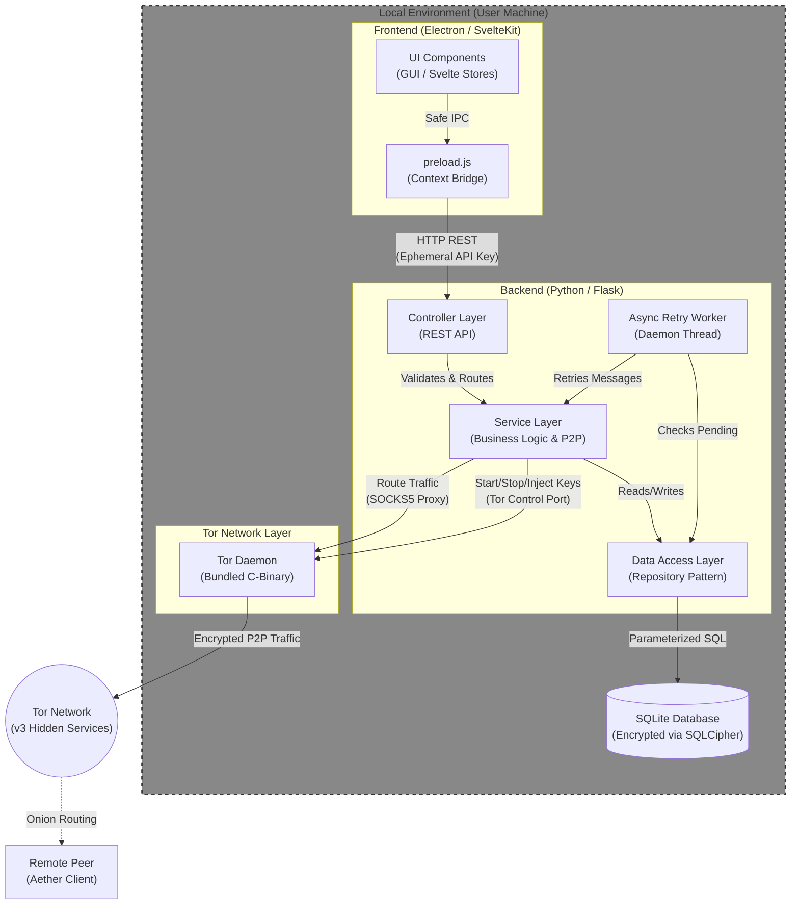
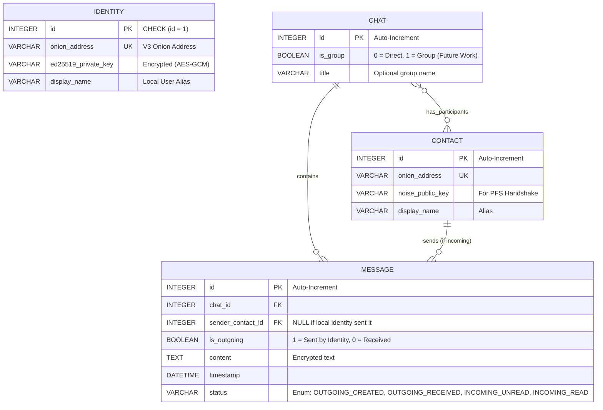

# Aether - Software Architecture (ARCHITECTURE.md)

## 1. Introduction & Architectural Principles

This document describes the software architecture of **Aether**, a decentralized peer-to-peer instant messenger designed for the secure communication of high-risk individuals (e.g., whistleblowers, investigative journalists).

The architecture strictly adheres to the principles of **"Security by Design"** and **"Privacy by Default"**. The following core architectural decisions and trade-offs are derived from these principles:

* **Complete Decentralization (No Servers):** To eliminate metadata accumulation, no central relay or routing servers exist. All communication occurs strictly Peer-to-Peer (P2P).
* **Tor Hidden Services as Transport Layer:** Routing and NAT traversal (firewall bypassing) are entirely offloaded to the Tor network (v3 Onion Services). This guarantees anonymity and thoroughly obfuscates user IP addresses.
* **Trade-off: Latency vs. Security:** The Tor network inherently introduces high latencies. Aether consciously accepts these performance penalties (e.g., during the connection setup of voice calls) in favor of maximum IP security.
* **Trade-off: Trust On First Use (TOFU):** To maintain usability when adding contacts without relying on central directories, users only exchange their Onion addresses out-of-band. The subsequent cryptographic key exchange happens automatically over the (already Tor-encrypted) P2P connection.
* **Trade-off: Proactive Schema Design for Decentralized Group Chats:** High-risk personas often require coordination within small, trusted teams. While fully decentralized P2P group chats (using a full-mesh topology connecting 3-5 users) are deferred to future iterations due to their networking complexity, the database schema is proactively designed to support them. Modifying local database schemas post-deployment is highly disruptive, so the relational foundation for n:m chat architectures is laid out strictly within the initial design.

## 2. System Architecture (Component View)

Aether utilizes a locally decoupled client-server architecture, where all components run exclusively on the end user's machine. The system consists of three main components:

1. **Frontend (Electron):** The presentation layer. It encapsulates the Graphical User Interface (GUI) and local state management.
2. **Backend / Middleware (Python Flask):** The business logic. It functions as a local REST server, manages cryptographic keys, controls database access, and coordinates asynchronous tasks (such as the message retry worker).
3. **Tor Daemon (C-Binary):** The network backbone. A bundled Tor binary (`tor`) included in the release, whose lifecycle (start/stop) is completely monitored and managed by the Python backend.

### Inter-Process Communication (IPC) & Security

The Electron frontend communicates with the Flask backend via a local RESTful API (e.g., on `http://127.0.0.1:5000`). To prevent other potentially malicious local software from accessing this API (localhost attack), a **dynamic, ephemeral API key** is generated every time the backend boots. This key is passed to the Electron process as an environment variable and must be included in the HTTP header of every REST call.

### Background Execution (NFR-07)

The architecture is designed so that closing the Electron window does not terminate the application, but merely minimizes it to the system tray. The Flask server and the Tor daemon continue running in the background to receive incoming P2P connections (messages & calls) at any time.

## 3. Detailed Application Architecture & Data Flow

### 3.1 High-Level Component Diagram



### 3.2 Frontend Architecture (SvelteKit & Electron IPC)

The presentation layer is implemented using **SvelteKit and Vite**. To strictly prevent breakouts from the browser context (Remote Code Execution via XSS), Electron's `ContextIsolation` is enabled.
The Svelte frontend has **no direct access** to Node.js APIs or the file system. All communication with the Flask backend occurs indirectly through a highly restrictive preload script (`preload.js` / Context Bridge), which only forwards specifically defined REST calls to the local API and signs them with the dynamic API key.

### 3.3 Backend Layers (Flask)

The Python backend is divided into three logical layers (Layered Architecture):

1. **Controller Layer:** Exposes the local REST API to the Svelte frontend and handles input validation. Since Tor does not support push notifications for asynchronous events, this layer also provides polling endpoints for the frontend (via Svelte Stores) to periodically fetch chat updates and incoming WebRTC signaling requests.
2. **Service Layer:** Contains the core business logic. It manages the Tor daemon lifecycle (start, stop, health checks), handles P2P connection establishments, and processes encryption protocols.
3. **Data Access Layer (DAL):** An abstraction layer (Repository Pattern) for all read and write operations to the local SQLite database.

### 3.4 Asynchronous Message Routing (Background Worker)

Aether operates without centralized servers. To still ensure high reliability, the backend implements an asynchronous **Retry Worker** (daemon thread). If a user sends a message to a contact whose Tor Hidden Service is currently offline, the message is stored in the database with the `OUTGOING_CREATED` status. The worker iteratively attempts to bootstrap a Tor circuit, establish a connection, and deliver the message in the background.
**Obfuscated ACK Processing (FR-07 & FR-08):** Furthermore, this worker is responsible for handling delivery acknowledgements (ACKs). To prevent presence leaks and mitigate millisecond-precision timing attacks by malicious peers, the worker actively injects randomized artificial timing delays (jitter) before transmitting these ACKs.

### 3.5 REST API Specification

The communication between the SvelteKit frontend and the Flask backend is handled via a local REST API (Base URL: `http://127.0.0.1:5000/api/v1`).

**Security Constraint:** To prevent malicious local software from accessing the API, every request must include the ephemeral API key (generated at boot) in the HTTP headers:
`X-Aether-API-Key: <ephemeral_key>`

#### 3.5.1 Authentication & Profile Management

These endpoints manage the "Database-per-Profile" lifecycle. The backend must unlock the specific `[username].aetherdb` file before any other endpoints can be accessed.

| Method | Endpoint | Description | Request Payload (Example) | Response Payload (Example) |
| :--- | :--- | :--- | :--- | :--- |
| `POST` | `/auth/register` | Creates a new identity, generates the Ed25519 key pair, and creates the encrypted `[username].aetherdb`. | `{"username": "elena", "password": "..."}` | `{"status": "success", "message": "Profile created.", "onion_address": "v2c7...onion"}` |
| `POST` | `/auth/login` | Unlocks the user's encrypted SQLite database and loads the Tor keys into RAM. | `{"username": "elena", "password": "..."}` | `{"status": "success", "message": "Database unlocked.", "onion_address": "v2c7...onion"}` |
| `POST` | `/auth/logout` | Locks the database and securely wipes the cryptographic keys from the backend's RAM. | *None* | `{"status": "success"}` |

#### 3.5.2 Contacts

| Method | Endpoint | Description | Request Payload (Example) | Response Payload (Example) |
| :--- | :--- | :--- | :--- | :--- |
| `GET` | `/contacts` | Returns a list of all saved contacts. | *None* | `[{"id": 1, "onion_address": "...", "display_name": "John"}]` |
| `POST` | `/contacts` | Adds a new contact (TOFU phase). Resolves the initial Onion address. | `{"onion_address": "...", "display_name": "John"}` | `{"id": 2, "onion_address": "...", "display_name": "John"}` |
| `PUT` | `/contacts/{id}` | Updates the local display name (alias) of an existing contact. | `{"display_name": "John Doe"}` | `{"status": "success"}` |
| `DELETE` | `/contacts/{id}` | Deletes the contact and cascades the deletion to all associated chats and messages. | *None* | `{"status": "success"}` |

#### 3.5.3 Chats & Messages

| Method | Endpoint | Description | Request Payload (Example) | Response Payload (Example) |
| :--- | :--- | :--- | :--- | :--- |
| `GET` | `/chats` | Returns all chats including their most recent message (for the UI chat list). | *None* | `[{"chat_id": 1, "is_group": 0, "title": null, "last_message": {"id": 42, "content": "Hello", "status": "INCOMING_UNREAD"}}]` |
| `GET` | `/chats/{id}/messages` | Returns the full message history for a specific chat. | *None* | `[{"id": 42, "sender_contact_id": 1, "content": "Hello", "timestamp": "2026-02-24T15:36:26Z", "status": "INCOMING_UNREAD"}]` |
| `DELETE` | `/chats/{id}` | Securely wipes the message history of a chat (`PRAGMA secure_delete`). | *None* | `{"status": "success"}` |
| `POST` | `/messages` | Queues a new outbound message. Sets status to `OUTGOING_CREATED`. The background worker handles the Tor routing. | `{"chat_id": 1, "content": "Hello via Tor!"}` | `{"message_id": 123, "status": "OUTGOING_CREATED"}` |
| `DELETE` | `/messages/{id}` | Deletes a specific message from the local database. | *None* | `{"status": "success"}` |

#### 3.5.4 System, Polling & Export

| Method | Endpoint | Description | Request Payload (Example) | Response Payload (Example) |
| :--- | :--- | :--- | :--- | :--- |
| `GET` | `/system/status` | Returns the current Tor daemon bootstrap percentage and network health. | *None* | `{"tor_bootstrap_percent": 100, "status": "ready"}` |
| `GET` | `/system/sync?since={timestamp}` | Long-polling endpoint for Svelte Stores. Returns new incoming messages and status updates (e.g., `OUTGOING_RECEIVED`) since the provided timestamp. | *None* | `{"new_messages": [...], "status_updates": [{"message_id": 123, "status": "OUTGOING_RECEIVED"}]}` |
| `POST` | `/export` | Generates a securely encrypted `.aetherbak` JSON archive (UC-10) containing the Identity, Contacts, and optionally the Chat History. | `{"export_password": "...", "include_chats": true}` | `{"status": "success", "file_path": "/path/to/export.aetherbak"}` |

## 4. Cryptography & Network Security

Because Aether is designed for high-risk personas (such as investigative journalists), the system extends far beyond standard transport encryption.

### 4.1 Identity Management & P2P Handshake

A user's cryptographic identity is an **Ed25519 Tor key pair**. This is generated by the backend, stored encrypted in the database, and injected into the Tor daemon's RAM at runtime.
During the first contact between two users (exchange of Onion addresses), an automatic handshake is performed over the Tor connection using the **Noise Protocol Framework** to establish *Perfect Forward Secrecy (PFS)* for text messages. This initially follows the "Trust On First Use" (TOFU) principle.

### 4.2 WebRTC over Tor (Voice Calls) [WIP]

> *Note: This section defines he architectural foundation and threat mitigation strategy for secure voice calls. However, the concrete software implementation is currently a Work In Progress (WIP) and might be deferred to a future iteration depending on time constraints.*

Aether utilizes WebRTC to enable native audio calls. Since default WebRTC behavior (especially the ICE framework for IP discovery via STUN/TURN) would cause massive IP leaks, Electron's WebRTC engine is forced into a strict **TCP-Relay-Only mode**. All media streams are routed exclusively through the local Tor SOCKS5 proxy. Signaling takes place over the P2P Tor connection. To satisfy the ICE framework, only artificial, local dummy IP addresses (e.g., `127.0.0.1`) are provided as ICE candidates.

### 4.3 Data-at-Rest & Export (UC-10)

All local data must remain protected even if third parties gain physical access to the device (NFR-04). To securely support multiple local users (Multi-Tenancy) without cross-contamination risks, Aether implements a strict **Database-per-Profile** architecture:

* **Cryptographic Isolation (Multi-Tenancy):** Instead of pooling multiple users into a single database, each user profile generates its own dedicated SQLite file (e.g., `[username].aetherdb`). The user's login password serves directly as the cryptographic key to decrypt their specific file. This guarantees that a vulnerability or logic flaw cannot accidentally expose another user's data, as the other databases remain physically encrypted on the disk.
* **Runtime Persistence:** The local SQLite database (`[username].aetherdb`) is transparently encrypted at the application level using **SQLCipher**.
* **Secure Backup:** For user exports (End-of-Life Offboarding), the system generates a structured JSON document containing all identities and contacts. This file (`.aetherbak`) is symmetrically encrypted with the industry-standard **AES-GCM** (including authentication) using a user-defined password.

## 5. Database Model & Persistence

Local data storage is handled by an application-side encrypted SQLite database (SQLCipher). To minimize external dependencies and guarantee maximum performance, Aether foregoes an Object-Relational Mapping (ORM) and uses the native `sqlite3` driver with parameterized raw SQL queries.

To consistently prevent "spaghetti code" and SQL injections, database access is strictly encapsulated via the **Repository Pattern**. The schema is highly normalized, utilizing synthetic (auto-increment) primary keys for decoupling, while cryptographic identities are secured by `UNIQUE` constraints.
**Secure Deletion (UC-09 & FR-12):** To fulfill the requirements for forensic security when deleting chat histories, the SQLite database is initialized with `PRAGMA secure_delete = ON`. This guarantees that deleted records are immediately overwritten with zeros on the storage medium, preventing data recovery.

**Database-per-Profile Architecture:** The schema strictly defines a 1:1 relationship between the database file and the local user identity. The `IDENTITY` table is hard-constrained to contain a maximum of one row. Consequently, entities like `CONTACT` or `CHAT` do not require foreign keys mapping them to a local identity, simplifying queries and preventing cross-tenant data leaks by design.

### Core Entities

* `Identity`: Stores the user's own Ed25519 key pair (encrypted) and local settings. Constrained to a maximum of one row per database file.
* `Contacts`: Stores the `.onion` address (`UNIQUE`), the Noise public key, and the display name of chat partners.
* `Messages`: Stores sender, recipient (foreign keys), the encrypted message content, timestamp, and delivery status (`OUTGOING_CREATED`, `OUTGOING_RECEIVED`, `INCOMING_UNREAD`, `INCOMING_READ`).

### Entity-Relationship-Diagram



### SQLite Schema

```sql
-- Enable secure deletion at the connection level to satisfy forensic requirements (UC-09 & FR-12)
-- This ensures deleted records are immediately zeroed out on the storage medium.
PRAGMA secure_delete = ON;

-- Table: IDENTITY
-- Stores the local user's cryptographic identity and settings.
-- Strict constraint: Only one row is allowed per database (Database-per-Profile architecture).
CREATE TABLE "identity" (
    "id" INTEGER PRIMARY KEY CHECK ("id" = 1),  -- Enforces a maximum of one identity per database file
    "onion_address" TEXT NOT NULL UNIQUE,       -- V3 Onion Address
    "ed25519_private_key" TEXT NOT NULL,        -- Encrypted via AES-GCM
    "display_name" TEXT                         -- Local User Alias
);

-- Table: CONTACT
-- Stores the local user's address book and trusted keys (TOFU).
CREATE TABLE "contact" (
    "id" INTEGER PRIMARY KEY AUTOINCREMENT,
    "onion_address" TEXT NOT NULL UNIQUE,
    "noise_public_key" TEXT,                    -- For PFS Handshake
    "display_name" TEXT NOT NULL                -- Alias for the UI
);

-- Table: CHAT
-- Represents a conversation thread. Proactively designed to support future n:m group chats.
CREATE TABLE "chat" (
    "id" INTEGER PRIMARY KEY AUTOINCREMENT,
    "is_group" INTEGER NOT NULL DEFAULT 0 CHECK ("is_group" IN (0, 1)), -- 0 = Direct, 1 = Group (Future Work)
    "title" TEXT                                -- Optional group name
);

-- Table: CHAT_MEMBER (Junction Table)
-- Resolves the many-to-many relationship between CHAT and CONTACT.
CREATE TABLE "chat_member" (
    "chat_id" INTEGER NOT NULL,
    "contact_id" INTEGER NOT NULL,
    PRIMARY KEY ("chat_id", "contact_id"),
    FOREIGN KEY ("chat_id") REFERENCES "chat"("id") ON DELETE CASCADE,
    FOREIGN KEY ("contact_id") REFERENCES "contact"("id") ON DELETE CASCADE
);

-- Table: MESSAGE
-- Stores the actual message history with delivery statuses.
CREATE TABLE "message" (
    "id" INTEGER PRIMARY KEY AUTOINCREMENT,
    "chat_id" INTEGER NOT NULL,
    "sender_contact_id" INTEGER,                -- NULL if the local identity sent it
    "content" TEXT NOT NULL,                    -- Encrypted text
    "timestamp" DATETIME DEFAULT CURRENT_TIMESTAMP,
    "status" TEXT NOT NULL CHECK ("status" IN ('OUTGOING_CREATED', 'OUTGOING_RECEIVED', 'INCOMING_UNREAD', 'INCOMING_READ')),
    
    FOREIGN KEY ("chat_id") REFERENCES "chat"("id") ON DELETE CASCADE,
    FOREIGN KEY ("sender_contact_id") REFERENCES "contact"("id") ON DELETE SET NULL,
    
    -- Domain integrity constraint: 
    -- If outgoing, there must be no sender_contact_id. 
    -- If incoming, a sender_contact_id must strictly be referenced.
    CONSTRAINT "chk_sender_integrity" CHECK (
        ("status" IN ('OUTGOING_CREATED','OUTGOING_RECEIVED') AND "sender_contact_id" IS NULL) OR 
        ("status" IN ('INCOMING_UNREAD','INCOMING_READ') AND "sender_contact_id" IS NOT NULL)
    )
);

-- Indices for UI performance and asynchronous chat loading
CREATE INDEX "idx_message_chat_id" ON "message"("chat_id");
```

### 5.1 Message Status Enum

The `status` column of the `MESSAGE` table uses a closed set of four string literals that encode both message direction and its current delivery/read state.

| Value | Direction | Description |
| --- | --- | --- |
| `OUTGOING_CREATED` | Outgoing | The message has been saved locally. The background worker is actively attempting to bootstrap a Tor circuit, establish a connection to the recipient's Hidden Service, and transmit the message. |
| `OUTGOING_RECEIVED` | Outgoing | The payload has been successfully transmitted over the Tor network to the recipient's daemon and a delivery ACK has been received back, confirming the recipient's node has received the message. |
| `INCOMING_UNREAD` | Incoming | An incoming message has been received from a remote peer and saved to the local database. The local user has not yet opened the conversation. |
| `INCOMING_READ` | Incoming | An incoming message has been opened in the chat UI, indicating that the local user has read the message. |

## 6. Applied Design Patterns

To ensure Clean Code guidelines and high maintainability, Aether implements the following established design patterns:

1. **Repository Pattern (Backend):** Encapsulation of all raw SQL commands within dedicated classes. The Service Layer operates exclusively on Python data objects (DTOs).
2. **Singleton Pattern (Backend):** Since exactly *one* Tor daemon may run on the system and bind to port 9050 at any given time, the `TorManager` is instantiated as a Singleton to prevent start/stop race conditions.
3. **Worker / Background Task Pattern (Backend):** An asynchronous daemon thread decouples the sending process from the HTTP request cycle to periodically re-deliver offline messages (status `OUTGOING_CREATED`) over the P2P network.
4. **Context Bridge / Facade (Frontend):** The `preload.js` script in Electron acts as a secure facade, providing the Svelte frontend with a highly limited, safe API while blocking direct Node.js access.
5. **Observer / Reactive Pattern (Frontend):** Utilization of *Svelte Stores* to reactively bind the UI to the backend's status polling mechanism without implementing complex event buses.

## 7. Technical Debt & Future Work

In the current iteration, conscious architectural compromises were made to keep the project scope focused. This "Technical Debt" is documented and scheduled for future development cycles:

* **MITM Vector during Bootstrapping:** The current "Trust On First Use" (TOFU) approach when exchanging Noise keys carries a theoretical Man-in-the-Middle risk at the Tor level.  
*Solution:* Implementation of out-of-band verification (e.g., visual QR code scanning).
* **I/O Inefficiency due to REST Polling:** The frontend's periodic polling to check for new messages creates continuous I/O load on the SQLite database.  
*Solution:* Migration of the IPC interface from synchronous REST to asynchronous Server-Sent Events (SSE) or WebSockets.
* **Perfect Forward Secrecy for Asynchronous Phases:** The Noise Protocol provides excellent security but is less flexible for long-lived asynchronous sessions than highly specialized protocols.  
*Solution:* Migration of text message encryption to the *Double Ratchet Algorithm*.
* **Linux System Tray Reliability (NFR-07):** The application minimizes to the system tray to run as a background daemon. However, on modern GNU/Linux desktop environments (especially Wayland/GNOME), system trays are notoriously unreliable.  
*Solution:* Implementation of a pure headless daemon mode as a fallback option.
* **Query Complexity:** Should the relational data model grow significantly in the future, maintaining the raw SQL repositories might become error-prone.  
*Solution:* Evaluation of a lightweight Query Builder.
* **Decentralized Small-Group Chats (Full-Mesh Topology):** Coordination among users currently requires separate direct messages.  
*Solution:* Implementation of a pure P2P group chat where every participant maintains a direct Tor connection to every other participant (n-to-n mesh network). The database model is already normalized to support this gracefully, limiting the necessary future work solely to the application logic and synchronization protocols.
